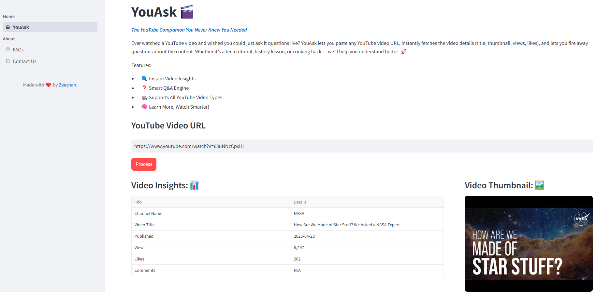

# YouAsk🎬
The YouTube Companion You Never Knew You Needed

Ever watched a YouTube video and wished you could just ask it questions live? YouAsk lets you paste any YouTube video 
URL, instantly fetches the video details (title, thumbnail, views, likes), and lets you fire away questions about the 
content. Whether it’s a tech tutorial, history lesson, or cooking hack — we’ll help you understand better. 🚀

Features:

* 🔍 Instant Video Insights
* ❓ Smart Q&A Engine
* 📽️ Supports All YouTube Video Types
* 🧠 Learn More, Watch Smarter!

# Application Link
    -

# Technologies Used
* Streamlit -- Front end development
* Langchain -- Framework to develop applications powered by LLM
* Groq -- LLM inference engine
* FAISS -- Vector store for RAG  
   
# System Requirements
You must have Python 3.11 or later installed.

# Installation
1. Clone this repository
2. Create a virtual environment
3. Install the necessary python packages:
   `pip install -r requirements.txt`
4. Run the application with following command from terminal:

   `streamlit run app.py`

# Screen Shots

